# quotez

A quotes app made with Flutter and serverpod mini as the backend.
# Trivico

Trivico is a simple quiz app built using Flutter as frontend and serverpod mini as the backend. It uses the Quotes API to fetch quotes and provide a fun and interactive user experience.

## Features

- Fetch quotes from the Quotes API
- Provide a fun and interactive user experience
- Save and share quotes

## Screenshots

### Light Theme

| Screenshot 1 | Screenshot 2 | Screenshot 3 |
| ------------ | ------------ | ------------ |
| 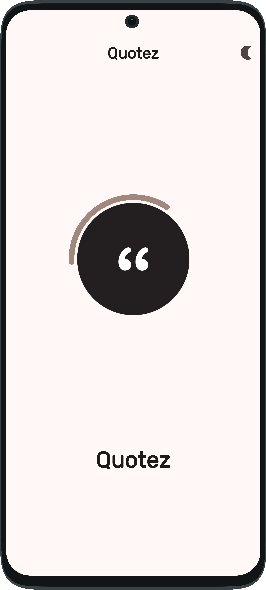 | 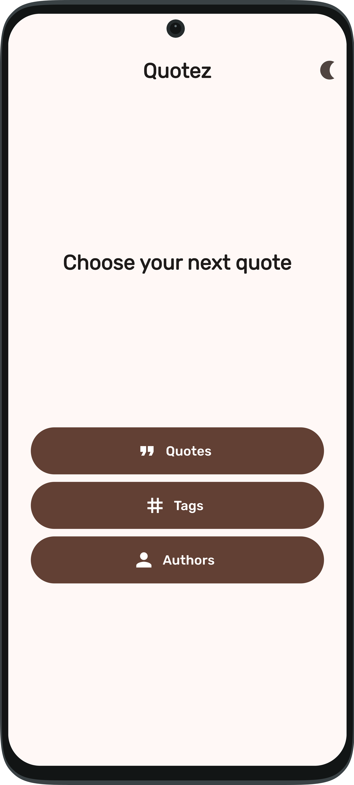 | 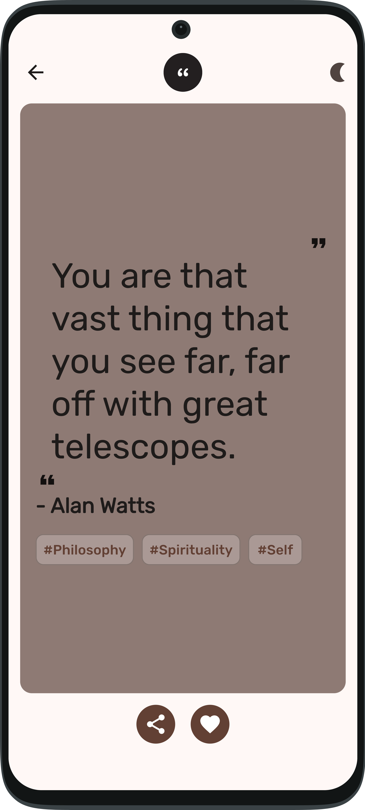 |

| Screenshot 4 | Screenshot 5 | Screenshot 6 |
| ------------ | ------------ | ------------ |
| 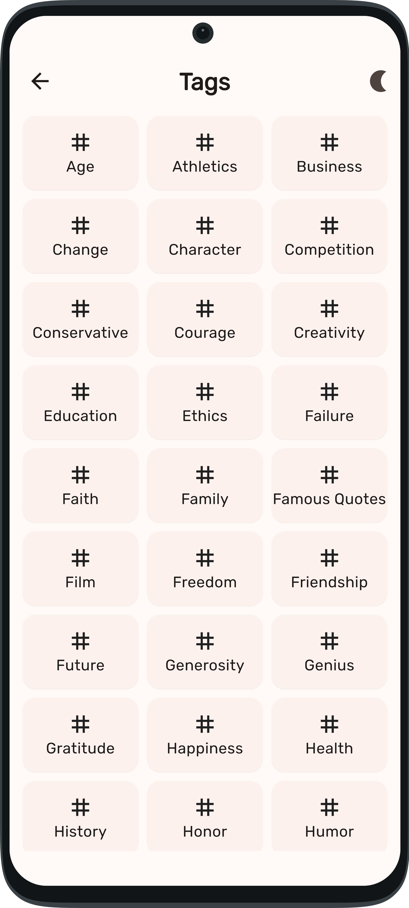 | 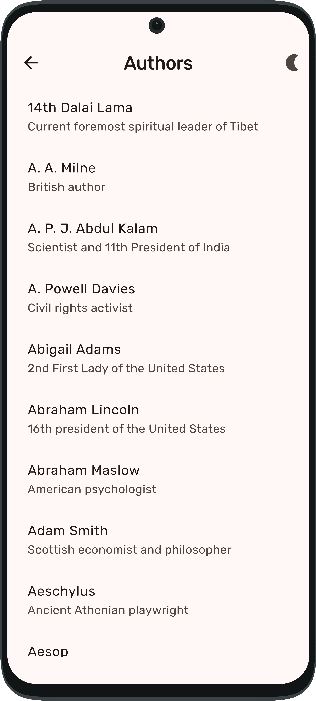 | 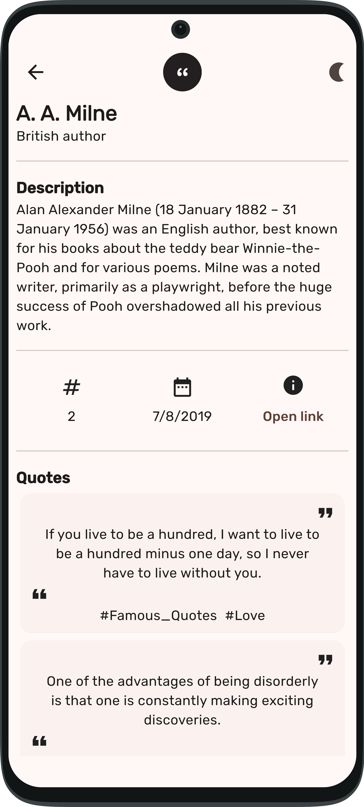 |

### Dark Theme

| Screenshot 1 | Screenshot 2 | Screenshot 3 |
| ------------ | ------------ | ------------ |
| 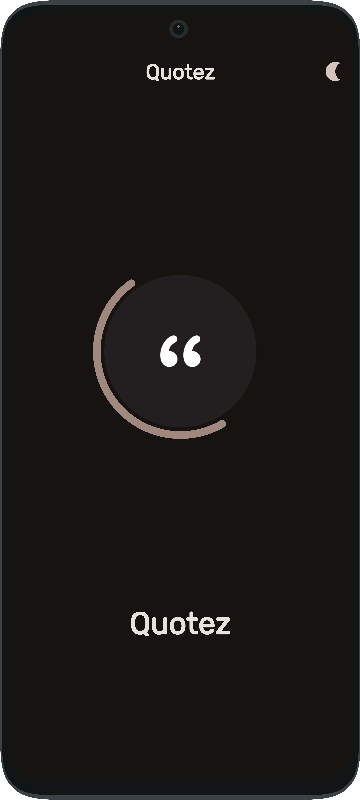 | 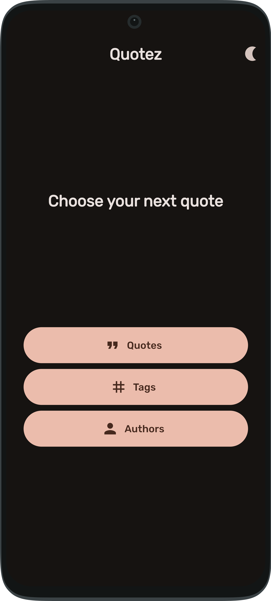 | 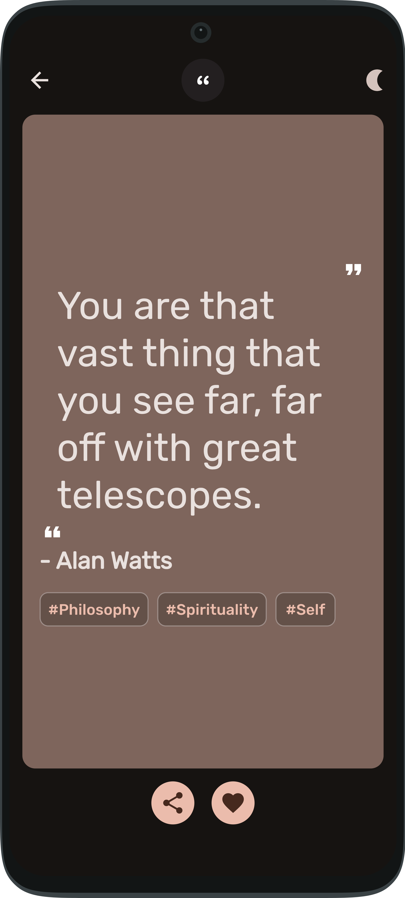 |

| Screenshot 4 | Screenshot 5 | Screenshot 6 |
| ------------ | ------------ | ------------ |
| 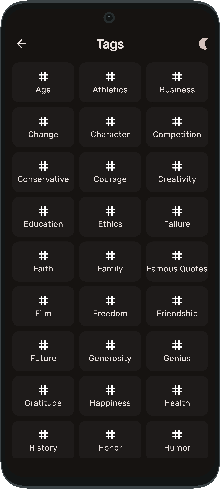 | 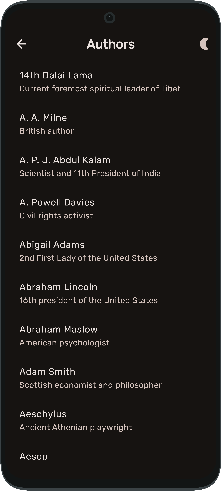 | 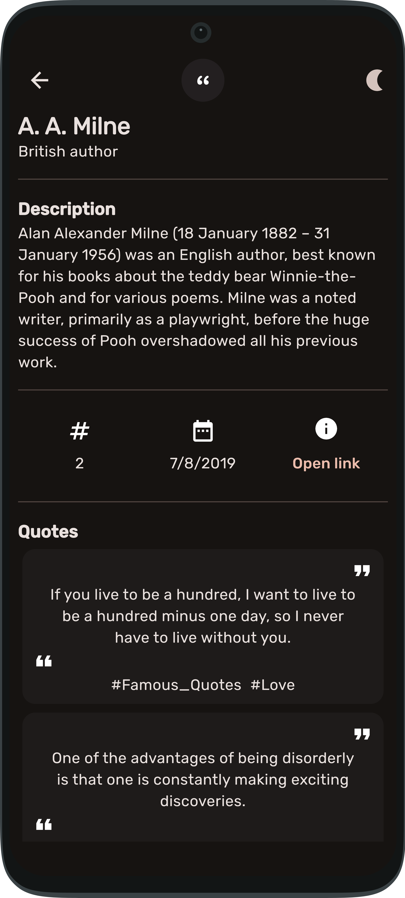 |

## Getting Started

To use this app, follow these steps:

1. Clone the repository.
2. Install Flutter by following the instructions on the [Flutter website](https://flutter.dev/docs/get-started/install).
3. Open a terminal and navigate to the project directory.
4. run `serverpod generate` in quotez_server
4. run `serverpod generate` in quotez_server
5. Run `dart bin/main.dart` to start the server.
4. Run `flutter pub get` in quotez_flutter to fetch the dependencies.
5. Run `flutter run` in quotez_flutter to start the app on a connected device or emulator.

## Contributing

Contributions are welcome! If you find any bugs or have suggestions for improvements, please open an issue or submit a pull request.

## License

This project is licensed under the MIT License - see the [LICENSE](LICENSE) file for details.
